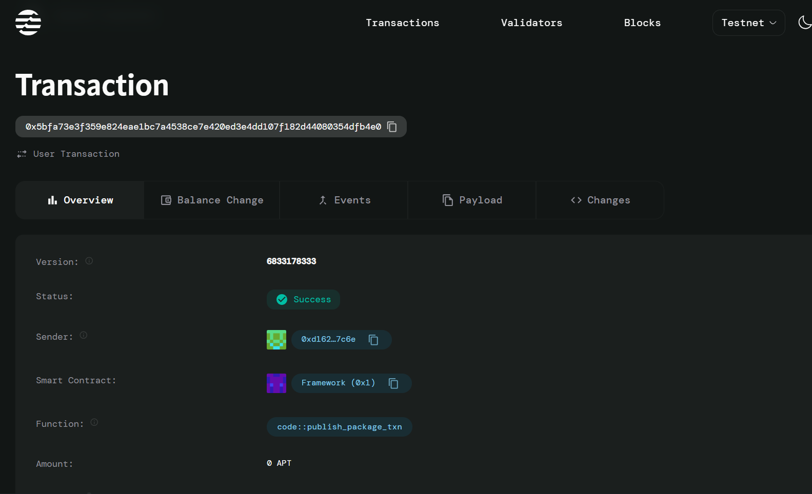

# Fantasy Sports

## Project Description
Create fantasy leagues with scoring and prize distribution on the Aptos blockchain. This smart contract enables users to create and join fantasy sports leagues, collect entry fees, and manage prize pools in a decentralized manner.

## Project Vision
To revolutionize fantasy sports by leveraging blockchain technology to ensure transparent, secure, and automated league management. Our platform aims to eliminate traditional intermediaries while providing players with complete ownership of their fantasy sports experience through decentralized smart contracts.

## Key Features

### 🏆 **Decentralized League Creation**
- Create custom fantasy leagues with configurable entry fees
- Set maximum participant limits for exclusive competitions
- Automatic prize pool accumulation from entry fees

### 💰 **Transparent Prize Distribution**
- All entry fees automatically contribute to the prize pool
- Transparent fund management through blockchain technology
- Secure payment processing using Aptos native tokens

### 🎮 **Seamless Participation**
- Easy league joining with automatic entry fee payment
- Player score tracking and management
- Real-time league status monitoring

### 🔒 **Security & Trust**
- Smart contract-based automation eliminates human error
- Immutable scoring records on the blockchain
- Transparent league operations visible to all participants

## Future Scope

### Phase 1: Core Expansion
- Advanced scoring algorithms integration
- Multi-sport support (NFL, NBA, MLB, Soccer)
- Automated prize distribution based on rankings

### Phase 2: Enhanced Features
- NFT-based player cards and achievements
- Cross-chain compatibility for wider adoption
- Mobile application development

### Phase 3: Ecosystem Growth
- Partnership with real sports data providers
- Tournament brackets and playoff systems
- Community governance and DAO implementation
- Staking mechanisms for enhanced rewards

### Phase 4: Advanced Analytics
- AI-powered player recommendations
- Historical performance analytics
- Social features and leaderboards
- Integration with sports betting platforms

## Contract Details
0x5bfa73e3f359e824eae1bc7a4538ce7e420ed3e4dd107f182d44080354dfb4e0
